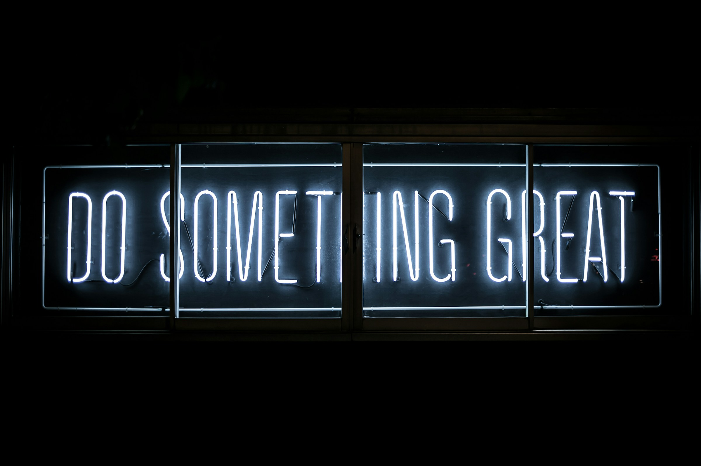

<!-- Hero -->

 

  <h1 align="center" style="font-size: 46px; color: #6EBB66; margin: 18px 0 4px 0;">Hi, I'm Fadma! 👋</h1>

  

    Full-Stack Developer · MERN &amp; React/Next-Laravel · AI-Augmented Applications
  

 

  

 

<!-- Badges -->

  
  
  

 

<!-- About -->
<h2 align="center" style="color: #FF6F61;">🚀 About Me</h2>

  I build full-stack applications where a clean API, a thoughtful interface, and
  the underlying data model actually agree with each other. My current focus is
  AI-augmented products - retrieval-augmented generation, embeddings, vector
  search, and local LLM inference - and shipping them as systems that hold up
  outside a demo.

 

<!-- Currently learning / contact -->

  <h3 style="color: #6B5B95;">🌱 Currently Learning</h3>
  

    AI agents, machine learning fundamentals, and retrieval architectures
  

  <h3 style="color: #6B5B95;">📫 Get in Touch</h3>
  

    <a href="mailto:fadma.charki101@gmail.com" style="color: #FF6F61; text-decoration: none; font-size: 18px; font-weight: bold;">
      fadma.charki101@gmail.com
    </a>
  

  

    👀 Take a look at my portfolio:
    <a href="https://fadmacharki.netlify.app/" target="_blank" style="color: #6EBB66; text-decoration: underline;">
      <strong>fadmacharki.netlify.app</strong>
    </a>
  

 

<!--
<h2 align="center" style="color: #FF6F61;">🚩 Recent Projects</h2>

  <h3 align="center" style="color: #6B5B95;">Project One</h3>

  

  

    One or two sentences on what it does and the problem it solves. Lead with
    the outcome rather than the stack, and name one hard part you had to solve
    so the work reads as engineering rather than as an exercise.
  

  

    
    
    
  

  

    
    
  

   

  

   

  <h3 align="center" style="color: #6B5B95;">Project Two</h3>

  

  

    Replace this with the project.
  

  

    
    
  

  

    
    
  

   

  

   

  <h3 align="center" style="color: #6B5B95;">Project Three</h3>

  

  

    Replace this with the project.
  

  

    
    
  

  

    
    
  

 

<!-- Tech stack -->
<h2 align="center" style="color: #FF6F61;">🛠️ Technologies &amp; Tools</h2>

<h3 align="center" style="color: #6B5B95;">Frontend Development</h3>

  
  
  
  
  
  
  
  

<h3 align="center" style="color: #6B5B95;">Styling &amp; Design</h3>

  
  
  
  

<h3 align="center" style="color: #6B5B95;">Backend Development</h3>

  
  
  
  
  
  
  

<h3 align="center" style="color: #6B5B95;">Databases</h3>

  
  
  
  
  

<h3 align="center" style="color: #6B5B95;">AI &amp; Machine Learning</h3>

  
  
  
  
  
  

<h3 align="center" style="color: #6B5B95;">Auth &amp; Security</h3>

  
  
  

<h3 align="center" style="color: #6B5B95;">DevOps &amp; Tools</h3>

  
  
  
  
  
  
  
  
  

 

─────────────────────────────────────

<!-- GitHub Stats -->
<h2 align="center" style="color: #FF6F61;">📊 GitHub Stats</h2>

  <picture>
    <source media="(prefers-color-scheme: dark)" srcset="https://github-readme-stats.vercel.app/api?username=Fcharki&show_icons=true&count_private=true&theme=dark&border_radius=15&bg_color=161B22&title_color=FB8C00&icon_color=6EBB66&text_color=FFFFFF&border_color=30363D&hide_border=false&card_width=400">
    <source media="(prefers-color-scheme: light)" srcset="https://github-readme-stats.vercel.app/api?username=Fcharki&show_icons=true&count_private=true&theme=default&border_radius=15&bg_color=FFFFFF&title_color=FB8C00&icon_color=6EBB66&text_color=20202A&border_color=E0E0E0&hide_border=false&card_width=400">
    
  </picture>

<!-- Streaks -->
<h2 align="center" style="color: #FF6F61;">🔥 GitHub Streaks</h2>

  <a href="https://git.io/streak-stats" target="_blank">
    <picture>
      <source media="(prefers-color-scheme: dark)" srcset="https://streak-stats.demolab.com/?user=Fcharki&theme=dark&hide_border=true">
      <source media="(prefers-color-scheme: light)" srcset="https://streak-stats.demolab.com/?user=Fcharki&theme=default&hide_border=true">
      
    </picture>
  </a>

<!-- Top Languages -->
<h2 align="center" style="color: #FF6F61;">👩🏻‍💻 Top Languages</h2>

  <picture>
    <source media="(prefers-color-scheme: dark)" srcset="https://github-readme-stats.vercel.app/api/top-langs/?username=Fcharki&layout=compact&bg_color=161B22&text_color=FFFFFF&border_color=30363D&border_radius=15&hide_border=false&langs_count=8&title_color=FFFFFF">
    <source media="(prefers-color-scheme: light)" srcset="https://github-readme-stats.vercel.app/api/top-langs/?username=Fcharki&layout=compact&bg_color=FFFFFF&text_color=20202A&border_color=E0E0E0&border_radius=15&hide_border=false&langs_count=8&title_color=20202A">
    
  </picture>

 

─────────────────────────────────────

<h2 align="center" style="color: #FF6F61;">📫 Let's Connect</h2>

  I'm always happy to talk about full-stack development, Laravel, or anything
  involving applied machine learning. If you have a project in mind, or just want
  to compare notes, my inbox is open.

  
  
  
  

